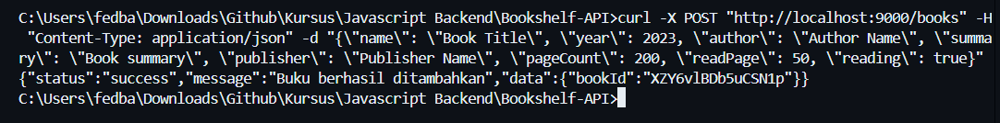
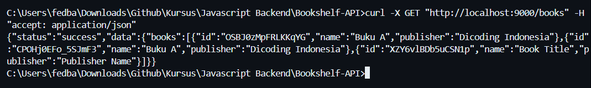
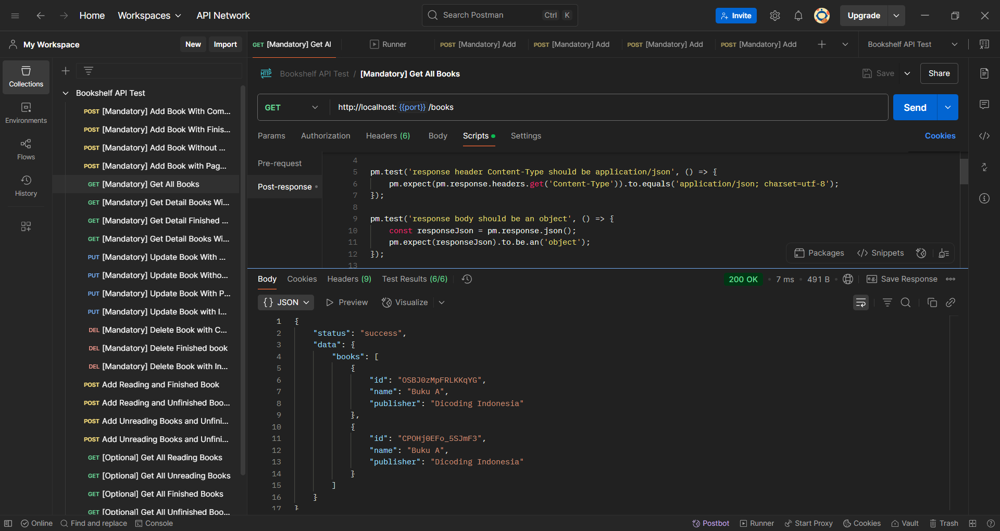
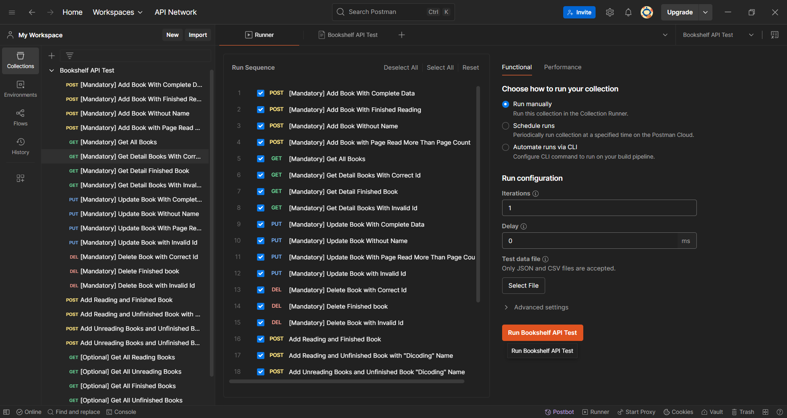
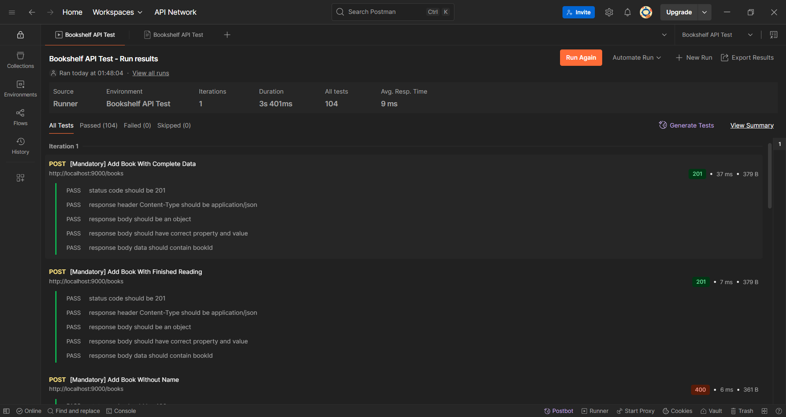
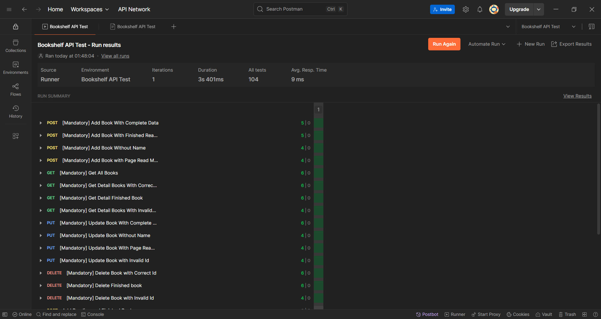
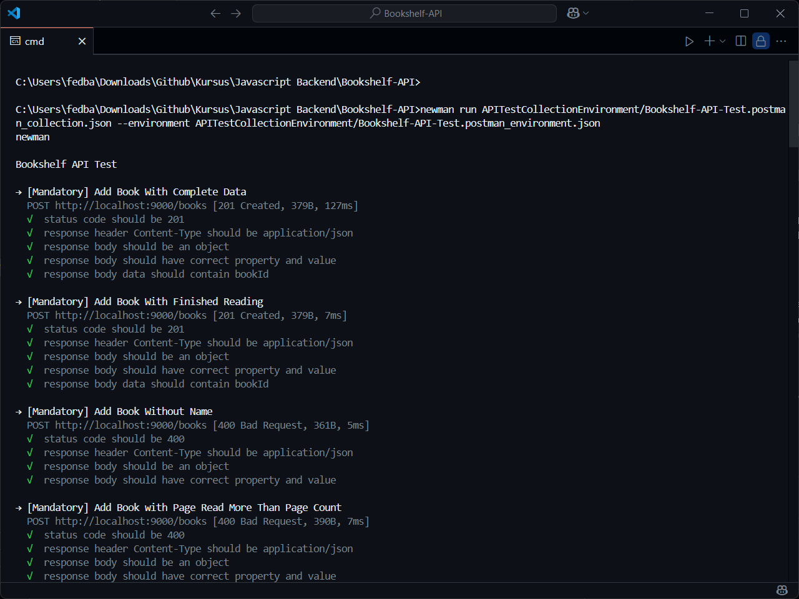
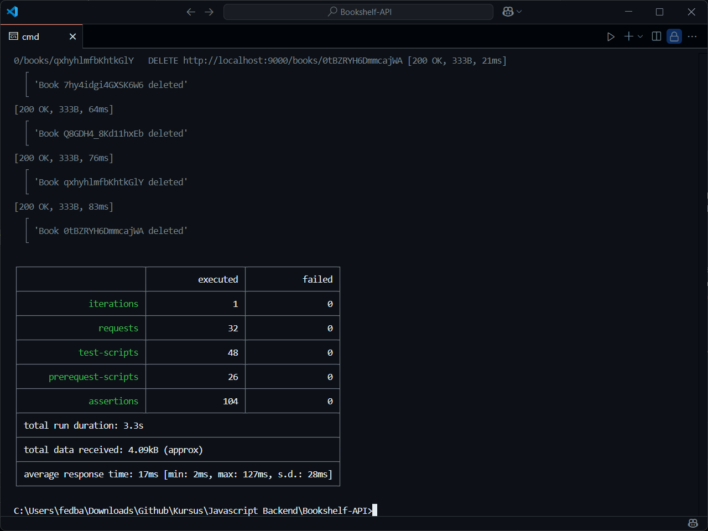

# Bookshelf App Back End

API RESTful untuk mengelola aplikasi rak buku. Proyek ini adalah bagian dari jalur pembelajaran Pengembangan Backend menggunakan Node.js dan Hapi Framework.

## Deskripsi

Bookshelf API memungkinkan pengguna untuk melakukan operasi CRUD (Create, Read, Update, Delete) pada buku. Setiap buku berisi detail seperti nama, tahun, penulis, ringkasan, penerbit, jumlah halaman, dan status membaca.

## Fitur

- Menambahkan buku baru ke rak buku
- Mendapatkan daftar semua buku
- Melihat informasi detail buku tertentu
- Memperbarui informasi buku
- Menghapus buku dari rak buku
- Fitur query untuk memfilter buku berdasarkan nama, status membaca, dan status penyelesaian

## Teknologi yang Digunakan

- Node.js
- Hapi.js
- Nodemon (untuk pengembangan)
- cURL (untuk pengujian API)
- Postman (untuk pengujian API)
- Newman (untuk pengujian otomatis)

## Instalasi

1. Clone repositori
2. Masuk ke direktori proyek
3. Pasang dependensi

```bash
npm install
```

## Penggunaan

Jalankan server dengan:

```bash
npm run start
```

Server akan berjalan di port 9000 secara default.

## Endpoint API

### Menambahkan buku

- **Metode**: POST
- **URL**: /books
- **Request Body**:

```json
{
    "name": string,
    "year": number,
    "author": string,
    "summary": string,
    "publisher": string,
    "pageCount": number,
    "readPage": number,
    "reading": boolean
}
```

**cURL (Windows Command Prompt):**

```bash
curl -X POST "http://localhost:9000/books" -H "Content-Type: application/json" -d "{\"name\": \"Book Title\", \"year\": 2023, \"author\": \"Author Name\", \"summary\": \"Book summary\", \"publisher\": \"Publisher Name\", \"pageCount\": 200, \"readPage\": 50, \"reading\": true}"
```



**PowerShell alternative:**

```powershell
Invoke-WebRequest -Uri "http://localhost:9000/books" -Method POST -ContentType "application/json" -Body '{"name": "Book Title", "year": 2023, "author": "Author Name", "summary": "Book summary", "publisher": "Publisher Name", "pageCount": 200, "readPage": 50, "reading": true}'
```

### Mendapatkan semua buku

- **Metode**: GET
- **URL**: /books
- **Parameter Query**:
  - `name`: Memfilter buku yang mengandung string tertentu di nama (tidak case-sensitive)
  - `reading`: Memfilter buku berdasarkan status membaca (0: tidak sedang dibaca, 1: sedang dibaca)
  - `finished`: Memfilter buku berdasarkan status penyelesaian (0: belum selesai, 1: sudah selesai)

**cURL**:

```bash
curl -X GET "http://localhost:9000/books" -H "accept: application/json"

# Dengan parameter query
curl -X GET "http://localhost:9000/books?name=javascript&reading=1&finished=0" -H "accept: application/json"
```



### Mendapatkan buku berdasarkan ID

- **Metode**: GET
- **URL**: /books/{id}

**cURL**:

```bash
curl -X GET "http://localhost:9000/books/{bookId}" -H "accept: application/json"
```

### Memperbarui buku

- **Metode**: PUT
- **URL**: /books/{id}
- **Request Body**: Sama seperti "Menambahkan buku"

**cURL (Windows Command Prompt):**

```bash
curl -X PUT "http://localhost:9000/books/{bookId}" -H "Content-Type: application/json" -d "{\"name\": \"Updated Book Title\", \"year\": 2023, \"author\": \"Author Name\", \"summary\": \"Updated summary\", \"publisher\": \"Publisher Name\", \"pageCount\": 200, \"readPage\": 75, \"reading\": true}"
```

**PowerShell alternative:**

```powershell
Invoke-WebRequest -Uri "http://localhost:9000/books/{bookId}" -Method PUT -ContentType "application/json" -Body '{"name": "Updated Book Title", "year": 2023, "author": "Author Name", "summary": "Updated summary", "publisher": "Publisher Name", "pageCount": 200, "readPage": 75, "reading": true}'
```

### Menghapus buku

- **Metode**: DELETE
- **URL**: /books/{id}

**cURL (Windows Command Prompt):**

```bash
curl -X DELETE "http://localhost:9000/books/{bookId}"
```

**PowerShell alternative:**

```powershell
Invoke-WebRequest -Uri "http://localhost:9000/books/{bookId}" -Method DELETE
```

## Struktur Proyek

```plaintext
bookshelf-api/
├── src/
│   ├── server.js       # Konfigurasi dan inisialisasi server
│   ├── routes.js       # Definisi rute API
│   ├── handler.js      # Penanganan request untuk setiap rute
│   └── books.js        # Pengelolaan data buku
├── package.json        # Dependensi dan script proyek
└── readme.md          # Dokumentasi proyek
```

## Pengujian

### Menggunakan Postman

API ini dapat diuji menggunakan koleksi Postman dan environment yang telah disediakan. Untuk menguji:

1. Gunakan koleksi dan environment pengujian dari folder `APITestCollectionEnvironment`
2. Impor kedua file (`Bookshelf-API-Test.postman_collection.json` dan `Bookshelf-API-Test.postman_environment.json`) ke Postman
3. Pilih environment "Bookshelf API Test"
4. Jalankan tes koleksi









### Menggunakan Newman

Untuk pengujian otomatis melalui command line, gunakan Newman:

1. Pasang Newman jika belum terpasang:

```bash
npm install -g newman
```

2. Jalankan tes menggunakan perintah:

```bash
newman run APITestCollectionEnvironment/Bookshelf-API-Test.postman_collection.json --environment APITestCollectionEnvironment/Bookshelf-API-Test.postman_environment.json
```

3. Hasil pengujian akan ditampilkan di terminal





## Lisensi

Proyek ini dibuat untuk tujuan edukasi sebagai bagian dari jalur pembelajaran Pengembangan Backend Dicoding.
